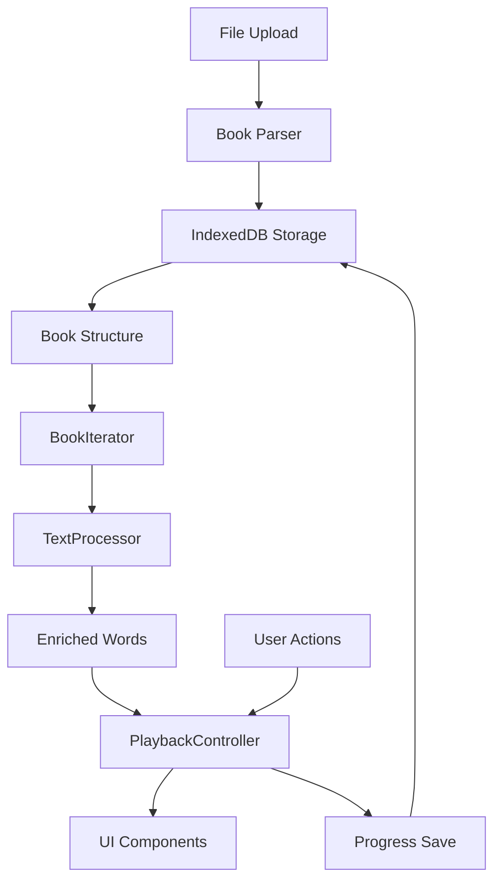

# Fast Focus Reader - Technical Documentation

## Proof of Concept

Fast Focus Reader is an RSVP (Rapid Serial Visual Presentation) reading application that displays text word-by-word, centered on screen. The core innovation is eliminating eye movement (saccades) by presenting one word at a time with the middle vowel/letter highlighted as an anchor point.

### Key Capabilities

- **Book Processing**: Parses TXT, EPUB, and FB2 files into structured format (Volumes → Chapters → Paragraphs → Sentences)
- **Word-by-Word Display**: Centers each word on screen with middle letter highlighted
- **Adjustable Speed**: Configurable WPM (words per minute) with warmup feature that gradually increases speed
- **Progress Tracking**: Automatically saves reading position to IndexedDB
- **Navigation**: Chapter navigation with table of contents, sentence/word-level controls
- **Multi-language Support**: English and Russian with language-aware text processing

## Motivation

### Problem

Traditional reading requires constant eye movement (saccades) to track lines of text, which:
- Limits reading speed (average: 200-250 WPM)
- Increases cognitive load from eye tracking
- Causes fatigue during long reading sessions

### Solution

RSVP technique eliminates eye movement by:
- Presenting one word at a time, centered on screen
- Highlighting the middle vowel/letter as a visual anchor
- Allowing adjustable reading speeds (200-400+ WPM)
- Reducing cognitive load by focusing attention on a single word

### Benefits

- **Faster Reading**: Achieve 300-500+ WPM with practice
- **Reduced Fatigue**: No eye tracking required
- **Better Focus**: Single word focus reduces distractions
- **Language Support**: Works with English and Russian text

## Architecture

### Technology Stack

- **Frontend**: React 19 + TypeScript + Vite
- **UI Framework**: Chakra UI v3
- **Storage**: IndexedDB (via `idb` library)
- **Routing**: React Router v7
- **Text Processing**: `Intl.Segmenter` API for language-aware sentence segmentation

### Core Components

#### Text Processing Pipeline

The text processing system uses a hierarchical approach:

```
Text → Paragraphs → Sentences → Words → Enriched Words
```

**Key Files**: `src/services/textProcessor.ts`, `src/utils/textProcessor.ts`

- **Paragraph Detection**: Uses double newlines or single newlines after sentence endings
- **Sentence Segmentation**: Leverages `Intl.Segmenter` for language-aware splitting
- **Word Processing**: Space-based splitting with punctuation attachment
- **Word Enrichment**: Adds punctuation context, quote/bracket tracking, special case detection (abbreviations, initials, decimals)

#### Book Management

**Key Files**: `src/utils/db.ts`, `src/utils/bookParser.ts`

- **Storage Schema**: IndexedDB with stores for `books`, `progress`, `settings`
- **Book Structure**: Hierarchical format supporting volumes, chapters, and paragraphs
- **File Parsing**: Supports EPUB (via JSZip), FB2 (XML parsing), and TXT files
- **Chapter Detection**: Automatic detection from patterns like "Chapter 1", "Chapter I", etc.

#### Playback System

**Key Files**: `src/services/playbackController.ts`, `src/hooks/useTextPlayback.ts`

The `PlaybackController` manages word-by-word timing and state:

- **Timing Control**: Calculates delays based on WPM and punctuation
- **Pause Configuration**: Different pause durations for commas, periods, question marks, etc.
- **Auto-stop**: Optional stopping at sentence/paragraph ends
- **State Management**: Tracks current word, sentence, playing state

**Pause Durations** (configurable):
- Comma: 200ms
- Period/Question/Exclamation: 800ms
- Paragraph end: 1200ms

#### Reader State Management

**Key File**: `src/hooks/useReader.ts`

Manages the reading position and navigation:

- **Position Tracking**: volume → chapter → sentence → word
- **Progress Persistence**: Auto-saves to IndexedDB
- **Navigation**: Methods for next/prev word, sentence, chapter
- **Title Display**: Shows volume/chapter titles when navigating

#### Book Iterator

**Key File**: `src/utils/bookIterator.ts`

Efficient chapter access with caching:

- **LRU Cache**: Caches processed chapters (default: 10 chapters)
- **On-demand Processing**: Processes chapters only when accessed
- **Enriched Words**: Provides enriched word data with context and punctuation
- **Paragraph Tracking**: Maintains paragraph boundaries for navigation

#### UI Components

**Main Components**:

- **`Reader`**: Main reading interface with routing (`/book/:bookId`)
- **`ReaderMainPanel`**: Displays current word (centered), sentence context, and full text
- **`ReaderControlsPanel`**: Playback controls (play/pause, navigation, WPM slider)
- **`AnchoredWordDisplay`**: Centers word around middle letter with visual guides (crosshair lines)
- **`Library`**: Book management and upload interface

### Data Flow



### Key Design Patterns

1. **Strategy Pattern**: Word processing strategies (space-based splitting) allow swapping implementations
2. **LRU Cache**: Chapter processing cache in `BookIterator` for efficient memory usage
3. **Observer Pattern**: `PlaybackController` notifies state changes via callbacks
4. **Hook-based Architecture**: React hooks (`useReader`, `useTextPlayback`) encapsulate state logic

### File Structure Overview

```
src/
├── components/          # React UI components
│   ├── Reader.tsx      # Main reader interface
│   ├── ReaderMainPanel.tsx
│   ├── ReaderControlsPanel.tsx
│   ├── Library.tsx
│   └── ...
├── hooks/              # Custom React hooks
│   ├── useReader.ts    # Reader state management
│   └── useTextPlayback.ts
├── services/           # Core business logic
│   ├── textProcessor.ts
│   ├── playbackController.ts
│   └── types.ts
├── utils/              # Utility functions
│   ├── db.ts          # IndexedDB operations
│   ├── bookParser.ts  # File parsing
│   ├── bookIterator.ts
│   └── textProcessor.ts
└── App.tsx            # Root component with routing
```

### Key Technical Decisions

1. **IndexedDB over localStorage**: Handles large book files efficiently
2. **Intl.Segmenter**: Language-aware sentence segmentation without regex complexity
3. **On-demand Processing**: Chapters processed only when accessed, reducing initial load time
4. **Enriched Words**: Pre-computes punctuation and context for better display and timing
5. **Warmup Feature**: Gradually increases WPM to help users adapt to faster speeds

### Performance Considerations

- **Chapter Caching**: LRU cache prevents reprocessing frequently accessed chapters
- **Lazy Processing**: Text processing happens on-demand, not at book load
- **Efficient Updates**: React hooks minimize re-renders through proper dependency arrays
- **IndexedDB**: Async operations don't block UI thread
